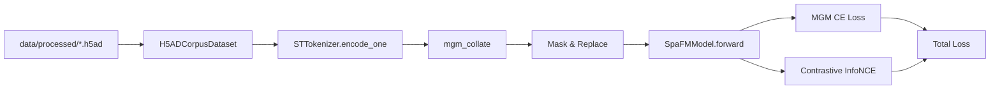

# Stage 4 — 多任务自监督预训练

> 状态：🟢 v0 完成（Lightning 训练骨架 + MGM + 对比学习 + smoke test）
>
> 上游：[stage3-模型架构.md](stage3-模型架构.md)　下游：[stage5-知识增强.md](stage5-知识增强.md)

---

## 1. 目标

在 Stage 1 构建的多平台 ST 语料上，对 [SpaFMModel](../../src/spafm/models/spafm.py) 进行**自监督预训练**，得到一个可被下游任务（细胞类型注释、空间域、基因插补等）复用的通用表征。

v0（笔记本验证）目标：

- ✅ 跑通 `corpus → dataset → dataloader → LightningModule → fit` 全链路
- ✅ Loss 数值合理且在几十步内可下降
- ✅ checkpoint 保存 / 恢复
- ✅ CPU 与 GPU 切换只需改 `accelerator`
- ⚪ 真正的多卡大语料预训练 → 服务器侧执行，仅需替换 yaml

---

## 2. 自监督任务设计

| 任务 | 缩写 | 监督信号来源 | 实现 |
|---|---|---|---|
| **Masked Gene Modeling** | MGM | 随机 mask 一部分基因 token，恢复其 ``value_ids`` | [masking.py](../../src/spafm/training/masking.py) + [losses.py](../../src/spafm/training/losses.py) |
| **Cell Contrastive Learning** | CCL | 对同一 cell 做两次 dropout/采样得到两个 view，InfoNCE 拉近 | [losses.py](../../src/spafm/training/losses.py) |
| 空间重建（占位） | SR | 用 niche bag 预测中心 cell 表达 | TODO Stage 5 |

总损失：

$$
\mathcal{L} = \lambda_\text{mgm}\,\mathcal{L}_\text{MGM} + \lambda_\text{ccl}\,\mathcal{L}_\text{CCL}
$$

v0 默认 $\lambda_\text{mgm}=1.0,\ \lambda_\text{ccl}=0.1$。

### MGM 细节

- 随机选 `mask_ratio=15%` 的非特殊 token
  - 80% 替换为 `[MASK]` (id=2)
  - 10% 替换为随机 gene id
  - 10% 保持原样
- 仅在被选中位置计算交叉熵（target=原 `value_ids`，bin 模式）
- 等价于 BERT 的 MLM 思路；预测目标是离散的表达 bin

### CCL 细节

- 同一 cell 走两次 tokenizer：因为 `gene_select=random_k` + dropout 自然产生两个 view
- 用 `ContrastiveHead` 把 `cell_repr` 投影到 128 维并 L2 归一化
- InfoNCE，温度 $\tau=0.07$，batch 内其他 cell 为负样本

---

## 3. 数据流



- **Dataset**：扫描一个或多个 `*.h5ad`，把所有 cell 拍平成一个全局索引
- **Tokenizer 复用**：训练侧只调用 `STTokenizer.encode_one` 单 cell 接口，避免每 batch 重复构图
- **Collator**：按 batch 内最长的有效 token 数 padding，节省显存

---

## 4. 模块边界

| 模块 | 职责 |
|---|---|
| [training/dataset.py](../../src/spafm/training/dataset.py) | `H5ADCorpusDataset` 把多个 h5ad 的 cell 拼成全局索引；惰性懒加载 |
| [training/collator.py](../../src/spafm/training/collator.py) | numpy → torch tensor，按 batch 最长长度 padding |
| [training/masking.py](../../src/spafm/training/masking.py) | `apply_mgm_mask`：返回 masked input + target + mask 位置 |
| [training/losses.py](../../src/spafm/training/losses.py) | `mgm_loss`、`info_nce` |
| [training/lit_module.py](../../src/spafm/training/lit_module.py) | `SpaFMPretrainModule`：组装模型 + heads + 优化器 + 训练步骤 |
| [scripts/train_pretrain.py](../../scripts/train_pretrain.py) | CLI 入口：`python -m scripts.train_pretrain --config configs/training/spafm-s-pretrain.yaml` |

---

## 5. 配置示例

[configs/training/spafm-s-pretrain.yaml](../../configs/training/spafm-s-pretrain.yaml)：

```yaml
data:
  h5ad_glob: "data/processed/*/demo_*.h5ad"
  vocab_path: null            # 为空时根据 corpus 内出现的基因即时建词表
  tokenizer_config: configs/tokenizer/spafm-s.yaml

model_config: configs/model/spafm-s.yaml

masking:
  mask_ratio: 0.15
  mask_token_prob: 0.8
  random_token_prob: 0.1

losses:
  mgm_weight: 1.0
  ccl_weight: 0.1
  ccl_temperature: 0.07

optim:
  lr: 3.0e-4
  weight_decay: 0.05
  betas: [0.9, 0.95]
  warmup_steps: 50
  max_steps: 1000

trainer:
  accelerator: auto         # cpu | gpu | auto
  devices: 1
  precision: 32
  max_steps: 1000
  log_every_n_steps: 10
  gradient_clip_val: 1.0
  default_root_dir: runs/spafm-s
batch_size: 4
num_workers: 0
seed: 42
```

---

## 6. 笔记本上的 smoke test

```bash
# 1. 先生成 demo 语料（Stage 1）
spafm-data build-all --config configs/data/corpus-v0.yaml --out-dir data/processed

# 2. 跑一遍极小预训练（CPU / 5 步，验证流程）
python -m scripts.train_pretrain \
  --config configs/training/spafm-s-pretrain.yaml \
  --override trainer.max_steps=5 \
             model_config=configs/model/spafm-tiny.yaml \
             trainer.accelerator=cpu
```

预期：5 步内损失打印正常，无 NaN，结束后 `runs/spafm-s/` 出现 checkpoint。

---

## 7. 服务器迁移备忘

笔记本侧只需保证：

- `make test` 全绿
- `python -m scripts.train_pretrain ... trainer.max_steps=5 batch_size=2` 跑得通

服务器侧只需：

```bash
git pull && pip install -e . \
  && python -m scripts.train_pretrain --config configs/training/spafm-s-pretrain.yaml \
       --override trainer.accelerator=gpu trainer.devices=1 trainer.precision=bf16 \
                  trainer.max_steps=100000 batch_size=64 num_workers=8
```

---

## 8. 验收清单

- [x] `H5ADCorpusDataset` + `mgm_collate` 完成
- [x] `apply_mgm_mask` 80/10/10 策略
- [x] `SpaFMPretrainModule` AdamW + 线性 warmup + cosine
- [x] `scripts/train_pretrain.py` CLI（支持 `--override key=value`）
- [x] smoke test：CPU 上 5 步内无 NaN、loss 有限
- [x] checkpoint 保存可加载
- [ ] 真预训练（≥10K 步） → 服务器执行
